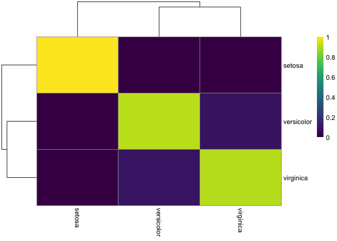

<!-- README.md is generated from README.Rmd. Please edit that file -->

# concordexR

<!-- badges: start -->

[](https://codecov.io/gh/pachterlab/concordexR)
<!-- badges: end -->

The goal of concordexR is to replace UMAP as a clustering diagnostic.

## Installation

You can install the development version of concordexR from
[GitHub](https://github.com/) with:

``` r
# install.packages("devtools")
devtools::install_github("kayla-jackson/concordexR")
```

## Example

This is a basic example using concordex:

``` r
library(concordexR)
library(BiocNeighbors)
```

``` r
g <- findKNN(iris[, seq_len(4)], k = 10)
#> Warning in (function (to_check, X, clust_centers, clust_info, dtype, nn, :
#> detected tied distances to neighbors, see ?'BiocNeighbors-ties'
res <- calculateConcordex(g$index, labels = iris$Species, k = 10, return.map = TRUE)
```

``` r
plotConcordexSim(res)
```


``` r
heatConcordex(res)
```


