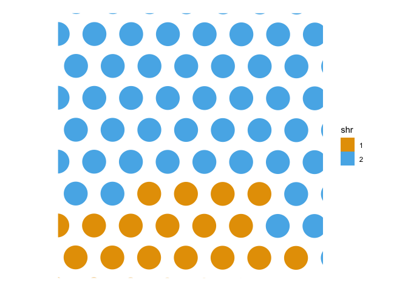

<!-- README.md is generated from README.Rmd. Please edit that file -->

# concordexR

<!-- badges: start -->

[](https://codecov.io/gh/pachterlab/concordexR)
[](https://bioconductor.org/checkResults/devel/bioc-LATEST/concordexR)
<!-- badges: end -->

The goal of concordexR is to identify spatial homogeneous regions (SHRs)
as defined in the recent manuscript, [“Identification of spatial
homogenous regions in tissues with
concordex”](https://doi.org/10.1101/2023.06.28.546949). Briefly, SHRs
are are domains that are homogeneous with respect to cell type
composition. `concordex` relies on the the k-nearest-neighbor (kNN)
graph to representing similarities between cells and uses common
clustering algorithms to identify SHRs.

## Installation

Versions of the `concordexR` package that do not enable clustering
spatial data into spatial homogeneous regions (SHRs) are available for
Bioconductor versions 3.17-19. The most recent version of the package is
slated to be released on Bioconductor version 3.20.

``` r
if (!requireNamespace("BiocManager", quietly = TRUE))
    install.packages("BiocManager")
    
BiocManager::install(version="3.20")
#> 'getOption("repos")' replaces Bioconductor standard repositories, see
#> 'help("repositories", package = "BiocManager")' for details.
#> Replacement repositories:
#>     CRAN: https://cran.rstudio.com/
#> Bioconductor version 3.20 (BiocManager 1.30.25), R 4.4.2 (2024-10-31)
#> Old packages: 'anytime', 'arrow', 'assorthead', 'BH', 'BiocCheck',
#>   'BiocNeighbors', 'Biostrings', 'bit', 'bit64', 'bookdown', 'class',
#>   'classInt', 'clue', 'cluster', 'cpp11', 'data.table', 'DelayedMatrixStats',
#>   'edgeR', 'evaluate', 'fitdistrplus', 'fontawesome', 'foreign',
#>   'GenomeInfoDb', 'geometry', 'ggmapinset', 'graph', 'graphlayouts', 'igraph',
#>   'IRanges', 'KernSmooth', 'knitr', 'later', 'limma', 'lme4', 'lpSolve',
#>   'lubridate', 'maps', 'MASS', 'MatrixGenerics', 'matrixStats', 'nnet',
#>   'parallelly', 'pillar', 'pkgbuild', 'processx', 'progressr', 'promises',
#>   'quantreg', 'Rcpp', 'RcppArmadillo', 'Rdpack', 'reticulate', 'Rfast',
#>   'rhdf5', 'rpart', 'RSQLite', 'Seurat', 'SFEData', 'shiny',
#>   'SingleCellExperiment', 'spatial', 'SpatialFeatureExperiment', 'spatialLIBD',
#>   'spatstat.data', 'spatstat.explore', 'spatstat.geom', 'spatstat.utils',
#>   'spData', 'spdep', 'stringdist', 'survival', 'systemfonts', 'terra',
#>   'testthat', 'textshaping', 'tidyterra', 'waldo', 'xfun', 'XML'
BiocManager::install("concordexR")
#> 'getOption("repos")' replaces Bioconductor standard repositories, see
#> 'help("repositories", package = "BiocManager")' for details.
#> Replacement repositories:
#>     CRAN: https://cran.rstudio.com/
#> Bioconductor version 3.20 (BiocManager 1.30.25), R 4.4.2 (2024-10-31)
#> Warning: package(s) not installed when version(s) same as or greater than current; use
#>   `force = TRUE` to re-install: 'concordexR'
#> Old packages: 'anytime', 'arrow', 'assorthead', 'BH', 'BiocCheck',
#>   'BiocNeighbors', 'Biostrings', 'bit', 'bit64', 'bookdown', 'class',
#>   'classInt', 'clue', 'cluster', 'cpp11', 'data.table', 'DelayedMatrixStats',
#>   'edgeR', 'evaluate', 'fitdistrplus', 'fontawesome', 'foreign',
#>   'GenomeInfoDb', 'geometry', 'ggmapinset', 'graph', 'graphlayouts', 'igraph',
#>   'IRanges', 'KernSmooth', 'knitr', 'later', 'limma', 'lme4', 'lpSolve',
#>   'lubridate', 'maps', 'MASS', 'MatrixGenerics', 'matrixStats', 'nnet',
#>   'parallelly', 'pillar', 'pkgbuild', 'processx', 'progressr', 'promises',
#>   'quantreg', 'Rcpp', 'RcppArmadillo', 'Rdpack', 'reticulate', 'Rfast',
#>   'rhdf5', 'rpart', 'RSQLite', 'Seurat', 'SFEData', 'shiny',
#>   'SingleCellExperiment', 'spatial', 'SpatialFeatureExperiment', 'spatialLIBD',
#>   'spatstat.data', 'spatstat.explore', 'spatstat.geom', 'spatstat.utils',
#>   'spData', 'spdep', 'stringdist', 'survival', 'systemfonts', 'terra',
#>   'testthat', 'textshaping', 'tidyterra', 'waldo', 'xfun', 'XML'
```

## Example

This is a basic example using concordex:

``` r
library(SFEData)
library(Voyager)
#> Loading required package: SpatialFeatureExperiment
#> 
#> Attaching package: 'SpatialFeatureExperiment'
#> The following object is masked from 'package:base':
#> 
#>     scale
library(scran)
#> Loading required package: SingleCellExperiment
#> Loading required package: SummarizedExperiment
#> Loading required package: MatrixGenerics
#> Loading required package: matrixStats
#> 
#> Attaching package: 'MatrixGenerics'
#> The following objects are masked from 'package:matrixStats':
#> 
#>     colAlls, colAnyNAs, colAnys, colAvgsPerRowSet, colCollapse,
#>     colCounts, colCummaxs, colCummins, colCumprods, colCumsums,
#>     colDiffs, colIQRDiffs, colIQRs, colLogSumExps, colMadDiffs,
#>     colMads, colMaxs, colMeans2, colMedians, colMins, colOrderStats,
#>     colProds, colQuantiles, colRanges, colRanks, colSdDiffs, colSds,
#>     colSums2, colTabulates, colVarDiffs, colVars, colWeightedMads,
#>     colWeightedMeans, colWeightedMedians, colWeightedSds,
#>     colWeightedVars, rowAlls, rowAnyNAs, rowAnys, rowAvgsPerColSet,
#>     rowCollapse, rowCounts, rowCummaxs, rowCummins, rowCumprods,
#>     rowCumsums, rowDiffs, rowIQRDiffs, rowIQRs, rowLogSumExps,
#>     rowMadDiffs, rowMads, rowMaxs, rowMeans2, rowMedians, rowMins,
#>     rowOrderStats, rowProds, rowQuantiles, rowRanges, rowRanks,
#>     rowSdDiffs, rowSds, rowSums2, rowTabulates, rowVarDiffs, rowVars,
#>     rowWeightedMads, rowWeightedMeans, rowWeightedMedians,
#>     rowWeightedSds, rowWeightedVars
#> Loading required package: GenomicRanges
#> Loading required package: stats4
#> Loading required package: BiocGenerics
#> 
#> Attaching package: 'BiocGenerics'
#> The following object is masked from 'package:SpatialFeatureExperiment':
#> 
#>     saveRDS
#> The following objects are masked from 'package:stats':
#> 
#>     IQR, mad, sd, var, xtabs
#> The following objects are masked from 'package:base':
#> 
#>     anyDuplicated, aperm, append, as.data.frame, basename, cbind,
#>     colnames, dirname, do.call, duplicated, eval, evalq, Filter, Find,
#>     get, grep, grepl, intersect, is.unsorted, lapply, Map, mapply,
#>     match, mget, order, paste, pmax, pmax.int, pmin, pmin.int,
#>     Position, rank, rbind, Reduce, rownames, sapply, saveRDS, setdiff,
#>     table, tapply, union, unique, unsplit, which.max, which.min
#> Loading required package: S4Vectors
#> 
#> Attaching package: 'S4Vectors'
#> The following object is masked from 'package:utils':
#> 
#>     findMatches
#> The following objects are masked from 'package:base':
#> 
#>     expand.grid, I, unname
#> Loading required package: IRanges
#> Loading required package: GenomeInfoDb
#> Loading required package: Biobase
#> Welcome to Bioconductor
#> 
#>     Vignettes contain introductory material; view with
#>     'browseVignettes()'. To cite Bioconductor, see
#>     'citation("Biobase")', and for packages 'citation("pkgname")'.
#> 
#> Attaching package: 'Biobase'
#> The following object is masked from 'package:MatrixGenerics':
#> 
#>     rowMedians
#> The following objects are masked from 'package:matrixStats':
#> 
#>     anyMissing, rowMedians
#> Loading required package: scuttle
library(bluster)

library(concordexR)
```

``` r
sfe <- McKellarMuscleData("small")
#> see ?SFEData and browseVignettes('SFEData') for documentation
#> loading from cache
clusters <- quickCluster(sfe, min.size=2, d=15)
```

``` r
nbc <- calculateConcordex(
    sfe,
    clusters,
    n_neighbors=10,
    BLUSPARAM=KmeansParam(2)
)

colData(sfe)[["shr"]] <- attr(nbc, "shrs")
```

``` r
plotSpatialFeature(sfe, features="shr")
```



## Citation

If you’d like to use the `concordexR` package in your research, please
cite our recent bioRxiv preprint

> Jackson, K.; Booeshaghi, A. S.; Gálvez-Merchán, Á.; Moses, L.; Chari,
> T.; Pachter, L. Quantitative assessment of single-cell RNA-seq
> clustering with CONCORDEX. bioRxiv (Cold Spring Harbor Laboratory)
> 2023. <https://doi.org/10.1101/2023.06.28.546949>.

@article {Jackson2023.06.28.546949, author = {Jackson, Kayla C. and
Booeshaghi, A. Sina and G{'a}lvez-Merch{'a}n, {'A}ngel and Moses, Lambda
and Chari, Tara and Kim, Alexandra and Pachter, Lior}, title =
{Identification of spatial homogeneous regions in tissues with
concordex}, year = {2024}, doi = {10.1101/2023.06.28.546949}, publisher
= {Cold Spring Harbor Laboratory}, URL =
{<https://www.biorxiv.org/content/early/2024/07/18/2023.06.28.546949>},
journal = {bioRxiv} }

## Maintainer

[Kayla Jackson](https://github.com/kayla-jackson)
